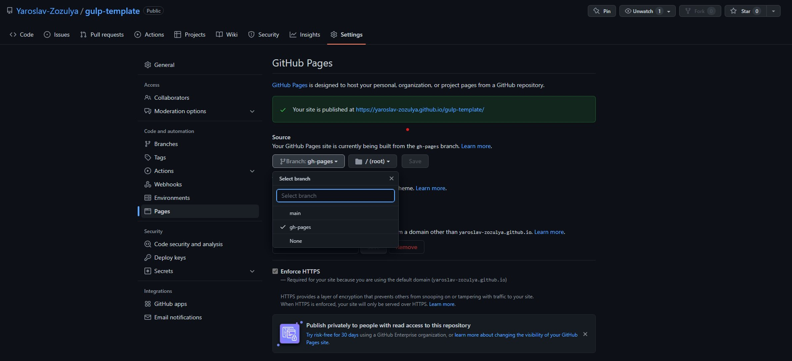

# Gulp template

## Node.js

Сборка проверена на версии [Node.js 16.15.0](https://nodejs.org/en/)

## Для начала работы

### Установить gulp-cli

```shell
npm install --global gulp-cli
```

### Настроить алиасы в VScode

- В VScode нажимаем F1;
- В строке пишем >Open Settings (json);
- В конец json файла добавляем объект настроек алиасов

```json
"path-autocomplete.pathMappings": {
    "@img": "${folder}/src/img", // alias for images
    "@scss": "${folder}/src/scss", // alias for scss
    "@js": "${folder}/src/js" // alias for js
}
```

### Работа со сборкой

- Клонируем репозиторий
- Устанавливаем зависимости

```shell
npm i
```

- Режим разработки

```shell
npm run dev
```

- Режим финальной сборки проекта

```shell
npm run build
```
### Деплой на git
При любых изминениях ветки main(master), после пуша в main или принятого пулреквеста проект автоматически будет собран и выгружен в ветку gh-pages.
Что бы увидеть livePage проекта, нужно зайти Settings -> Pages -> настроить отображение живой страницы с ветки gh-pages.
 
